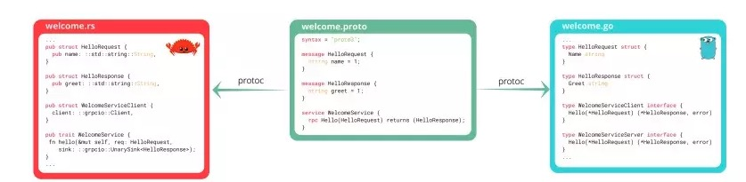

# node grpc demo

用 node 实现 grpc demo，其中包括 服务端、客户端以及前端。

### 如何启动？

```bash
# 安装依赖
yarn

# 启动服务端
yarn start:server
# 启动客户端
yarn start:client
# 启动前端
yarn start:frontend
```

### RPC 与 REST 的区别

#### 传输速度

REST 在 HTTP 应用层中完成，整个通信的代价较高；而 RPC 直接基于 TCP 进行远程调用，数据传输在传输层 TCP 层完成，所以传输性能更高。

无论是Google、Amazon、netflix（据说很可能转向 gRPC），还是阿里，实际上内部都是采用性能更高的 RPC 方式。而对外开放的才是 RESTful。

#### 传输效率

以 gRPC 为例，gRPC 使用 protobufs 来高效的序列化数据，使得传输效率更高。

相关阅读：
[Protobuf是如何进一步提高编码效率的?](https://time.geekbang.org/column/article/247544?utm_source=related_read&utm_medium=article&utm_term=related_read)

#### 流式传输

以 gRPC 为例，借助于 HTTP2 的能力，gRPC 支持流式传输。

#### 自动生成代码

以 gRPC 为例，gRPC 可以自动生成各个语言的通信代码



#### 调试

Rest 调用及测试都很方便，RPC就显得有点麻烦。

<!-- ### 如何生成模版代码？ -->

<!-- todo -->

<!-- ### 如何流式传输？ -->

<!-- todo -->

<!-- ### protobuf 单独使用 -->

<!-- todo -->